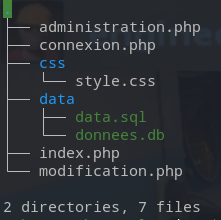

# EdTOnline

Ce projet consiste en la création d'un site web de gestion d'emploi du temps.

## Technologies utilisés : 

- HTML/CSS/Bootstrap : Frontend, interface utilisateur.
- PHP : Backend, gestion des requête à la base de données.
- SQLite3 : Base de données.

## Base de données

L'université posséde 4 départements (Math, Informatique, SVT et Chimie), il n'est pas possible d'en rajouter.

Chaque département posséde 5 années d'étude (Licence 1,2 et 3 et Master 1 et 2). Une promotion correspond à une année d'étude selon son département, par exemple 1ère année de licence en Math, 2éme années de master en Chimie.

Un type de cours (un TD par exemple) posséde un nom ainsi qu'une durée afin de simplifier le calcul de l'heure de fin d'un créneau lors de la création de ce dernier.

Il existe 3 type d'utilisateurs :

- Les étudiants, ne pouvant que consulter leur emploi du temps.
- Les professeurs, qui peuvent consulter leur emploi du temps. Ils peuvent aussi créer de nouveaux créneaux, modifier des créneaux déjà existant ou d'en supprimer.
- Les administrateurs, pouvant créer un nouvelle utilisateur, créer un nouveau type de cours (TD,TP,Cours,Exam...), créer une nouvelle salle, créer un nouveau module et voir le total des heures de cours d'un professeur.

Les Professeurs et les Admnistrateurs ne possédent pas de Promotion.

Les formulaire demandant une heure n'utilise pas de DateTime mais des simples champs de saisie de nombres, afin de simplifier leur enregistrement dans la base de données.

## Informations sur la création de nouvelles données

- Lorsqu'un utilisateur est créé, si ce n'est pas un étudiant, alors la valeur du champs "Promo" ne sera pas prise en compte.
- Un module ne dépent pas d'une promo, ainsi un étudiant d'Informatique et un étudiant de Mathématique peuvent tout deux participer au module "Algèbre" par exemple.
- Un professeur ne peut pas avoir 2 créneaux à la même heure.
- Lors de la création d'un nouveau créneau, le professeur qui y sera assigné correspond au professeur actuellement connecté et non au professeur référant.
- La valeur "nom" d'un cours correspond à son abréviation (TD pour Traveaux Dirigés, Exam pour Examens);

## Architecture du site

## Informations utiles :

Il y a un fichier "data.sql", celui permet de remettre les valeurs de la base de données au valeurs de test, afin de s'en servir, voilà la démarche a suivre : 

- Ouvrir un terminal dans le rèpertoire du projet
- Ouvrir le fichier "donnees.db" avec la commande sqlite3, ``sqlite3 donnees.db``
- Utiliser ``.read`` avec le fichier data.sql comme suit : ``.read data.sql``.

Afin de tester l'application, il existe déjà des utilisateurs :
- nom : Cidu, prénom : Léléveas. Un élève en 3e année de Licence Informatique.
- nom : Duchmol, prénom : Jean. Un professeur.
- admin admin, un administrateur du site.

